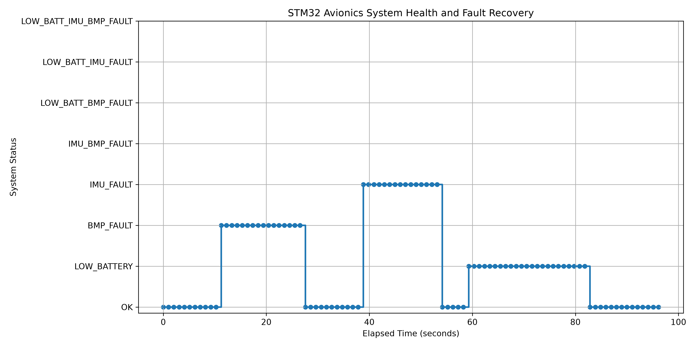

# STM32 Avionics Power Monitor

An STM32-based avionics monitoring system that measures battery voltage, current, pressure, temperature, acceleration, and rotation while transmitting telemetry for Python-based testing and analysis.

## Project Status

This project is currently in development.

## System Requirements

1. The system shall collect telemetry at 10 samples per second.
2. The system shall measure an external voltage between 0 and 9 volts.
3. The system shall report temperature in degrees Celsius.
4. The system shall report pressure in pascals.
5. The system shall report acceleration on three axes.
6. The system shall report angular velocity on three axes.
7. The system shall measure load voltage and current.
8. The system shall transmit telemetry through UART.
9. The system shall identify when a sensor cannot be reached.
10. The system shall produce a low-voltage warning below 6 volts.
11. The computer shall save received telemetry as a CSV file.
12. The Python program shall generate graphs of voltage, current, temperature, pressure, and acceleration.
13. The complete system shall operate for at least 30 minutes without crashing.
14. Each requirement shall have a documented pass/fail verification result.

## Planned Hardware

- STM32 Nucleo development board
- Pressure and temperature sensor
- Accelerometer and gyroscope
- Current sensor
- Battery-voltage sensing circuit
- Breadboard and jumper wires

## Planned Software

- Embedded C
- STM32CubeIDE
- Python
- Git and GitHub
- Altium Designer

## Current Milestone

## Reliability and Fault-Recovery Testing

The system was tested by deliberately introducing hardware faults during live operation to verify that the firmware could detect failures, prevent stale telemetry, and automatically recover without requiring a reset.

### Test Results

- Total test duration: 96.1 seconds
- BMP390 communication fault: detected and recovered
- LSM6DSOX communication fault: detected and recovered
- Low-battery condition: detected and recovered
- Successful recoveries: 3
- Final system state: OK
- Test result: PASS

During sensor communication failures, invalid sensor measurements are cleared rather than continuing to transmit stale data. When the sensor reconnects, the STM32 automatically detects it, reapplies its configuration, and resumes normal telemetry.

### System Health Timeline

